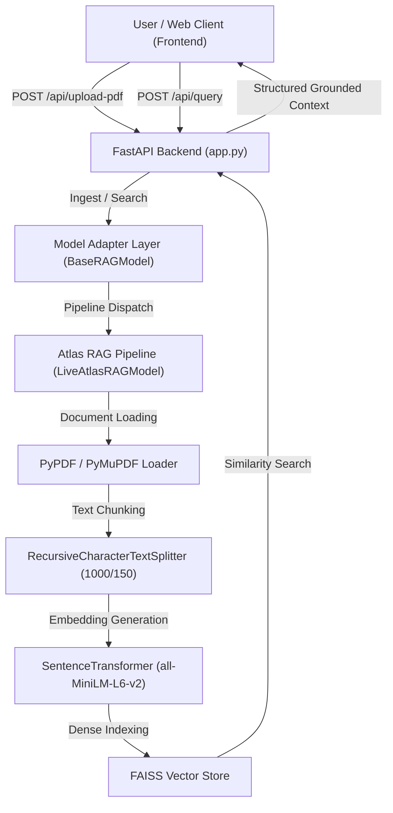

# Atlas — PDF Retrieval & Context Grounding Engine

**Atlas** is an enterprise-grade Retrieval-Augmented Generation (RAG) system engineered for domain-specific PDF document contextualization, granular passage search, and interactive context management.

It features a minimalist, human-designed 2-column interface paired with a high-throughput FastAPI REST backend and a decoupled RAG model architecture.

---

## 🏛️ System Architecture



---

## ✨ Core Key Features

1. **Dense Vector RAG Pipeline**:
   - Leverages `sentence-transformers/all-MiniLM-L6-v2` generating 384-dimensional dense semantic vector representations.
   - Utilizes `FAISS` in-memory vector index for sub-millisecond similarity retrieval.
   - Grounded context synthesis with exact cosine similarity matching scores.

2. **PDF Library & Active Context Selection**:
   - Dynamic document registry tracking all ingested PDFs.
   - **Checkbox Selection**: Include or exclude specific PDFs from active query context in real-time without re-ingesting document embeddings.
   - Automatic startup disk sync scanning `data/` folder for pre-existing documents.

3. **Disk Storage & Memory Management**:
   - **Physical File Deletion**: Deleting a document from the PDF Library automatically purges vector chunks from memory **AND removes the physical `.pdf` file from disk (`data/` directory)** to prevent storage bloat.

4. **Clean Minimalist UI**:
   - Human-crafted typography using `Inter` font, crisp neutral borders (`#e4e4e7`), and dark zinc accents.
   - Completely free of AI template clutter, glowing gradients, or unnecessary emojis.

---

## 🔗 Model Integration Architecture

The backend utilizes an **Abstract Adapter Pattern** (`BaseRAGModel`) located in `backend/src/atlas_rag/model_adapter.py`. This decouples the REST server from the underlying machine learning implementation.

### Integrated Model Stack (`backend/src/atlas_rag/pipeline.py`):

- **Loader**: `PyPDFLoader` / `PyMuPDFLoader` (`langchain_community`)
- **Text Splitter**: `RecursiveCharacterTextSplitter(chunk_size=1000, chunk_overlap=150)`
- **Embeddings**: `HuggingFaceEmbeddings` / `SentenceTransformer` (`sentence-transformers/all-MiniLM-L6-v2`)
- **Vector Search**: `FAISS` (`faiss-cpu`)

### Connecting Custom Models:

To update or replace the model engine:
1. Implement the `BaseRAGModel` interface in `backend/src/atlas_rag/`:
   ```python
   from .model_adapter import BaseRAGModel

   class CustomRAGModel(BaseRAGModel):
       def ingest_document(self, file_path: str, filename: str): ...
       def query(self, prompt: str, page_selection: str = None, top_k: int = 4): ...
       def get_all_documents(self): ...
       def toggle_document_active(self, filename: str, is_active: bool): ...
       def delete_document_context(self, filename: str, disk_path: str = None): ...
   ```
2. Export the instance in `backend/src/atlas_rag/__init__.py`.

---

## 📡 REST API Reference

| Method | Endpoint | Description |
| :--- | :--- | :--- |
| `GET` | `/api/status` | System health check and active engine pipeline metadata |
| `POST` | `/api/upload-pdf` | Ingests PDF document into RAG vector index |
| `POST` | `/api/query` | Executes vector similarity query across active PDF contexts |
| `GET` | `/api/documents` | Lists all PDFs in library with active checkbox states |
| `POST` | `/api/documents/toggle` | Toggles whether a PDF is active in query context |
| `DELETE` | `/api/documents/{filename}` | Permanently deletes PDF from memory and disk storage |
| `GET` | `/api/contexts` | Lists active retrieved text passages |
| `DELETE` | `/api/contexts/{chunk_id}` | Removes a specific chunk passage by ID |
| `POST` | `/api/contexts/clear` | Clears all context passages and deletes files |

---

## 🛠️ Project Structure

```
.
├── backend/
│   ├── app.py                    # FastAPI application & REST routing
│   ├── requirements.txt          # Python dependencies
│   └── src/
│       └── atlas_rag/
│           ├── __init__.py        # Factory loader
│           ├── model_adapter.py   # Abstract Base Class contract
│           ├── pipeline.py        # Live Atlas RAG Pipeline (LangChain, FAISS, SentenceTransformer)
│           ├── live_rag.py        # Live Model wrapper
│           └── mock_rag.py        # Fallback Engine
├── frontend/
│   ├── index.html                # Clean 2-column web interface
│   ├── css/
│   │   └── style.css             # Minimalist responsive stylesheet
│   └── js/
│       └── app.js                # Frontend REST API integration logic
└── data/                         # Active PDF storage directory
```

---

## 🚀 Getting Started

### Prerequisites:
- Python 3.9+

### Installation & Execution:

1. **Install Dependencies**:
   ```bash
   cd backend
   pip install -r requirements.txt
   ```

2. **Launch Application Server**:
   ```bash
   python3 -m uvicorn app:app --port 8000
   ```

3. **Access Application**:
   Open **`http://127.0.0.1:8000/`** in your browser.
